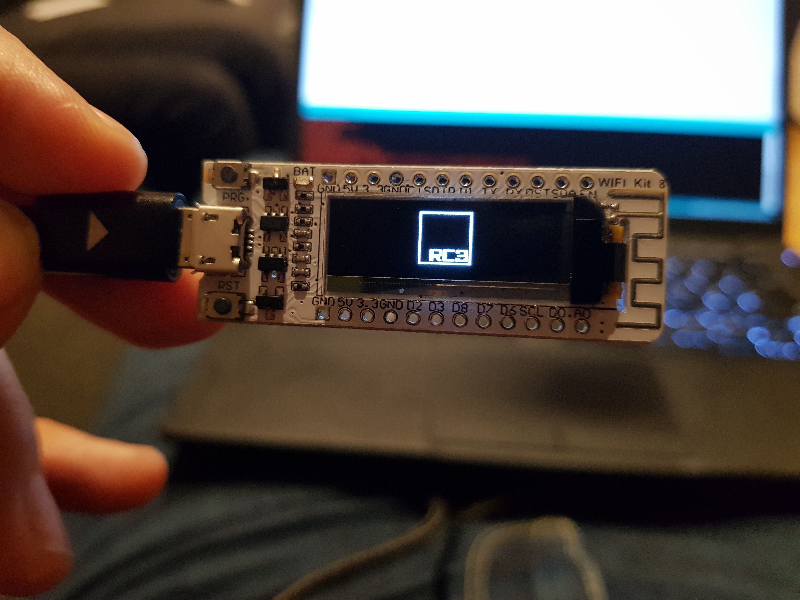

# microcontroller_haecksen

Setup:
- install Arduino suite
- install ESP8266:
https://arduino-esp8266.readthedocs.io/en/latest/installing.html
- install libraries:
Adafruit GFX Library, Adafruit SSD1306

rc3_intro.ino

Images are black and white and can have these dimensions: 128x32 

Here is a tool to convert images to "Adafruit GFXbitmapFont": 
http://javl.github.io/image2cpp/

mqtt example

Add your WiFi SSID and password and a MQTT server (e.g. test.mosquitto.org)

For the Python script:
Install https://pypi.org/project/paho-mqtt/

More info on mqtt: 
https://medium.com/python-point/mqtt-basics-with-python-examples-7c758e605d4
